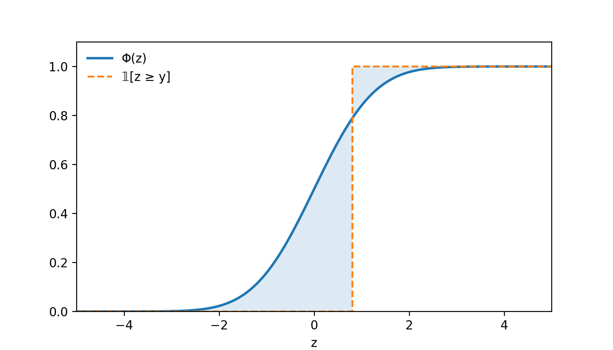

# CRPS Cheatsheet

## Definition

The Continuous Ranked Probability Score (or CRPS) is given by:

$$
\mathrm{CRPS}(F, y) = \int \big(F(z) - \mathbb{1}[y \leq z]\big)^2 dz
$$

Note that $\big(F(z) - \mathbb{1}[y \leq z]\big)^2$
is the Brier score for a fixed value of $z$. CRPS integrates over all choices of $z$.

### Intuition

CRPS is the integral of the squared distance between the predicted cumulative density function (CDF) and the empirical CDF of a single observation, $y$. If $y$ is known, it is minimised by a point estimate at $y$. CRPS rewards sharp, calibrated predictions. 

